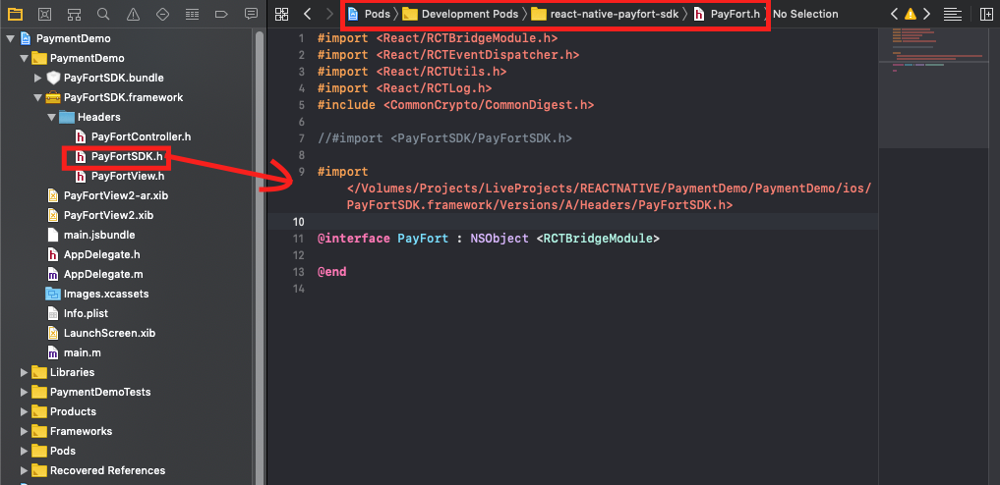

<p align="left">
<a href="https://www.npmjs.com/package/@logisticinfotech/react-native-payfort-sdk"></a>
<a href="https://www.npmjs.com/package/@logisticinfotech/react-native-payfort-sdk"></a>
<a href="https://www.npmjs.com/package/@logisticinfotech/react-native-payfort-sdk"<></a>
</p>

# @logisticinfotech/react-native-payfort-sdk

## Getting started

`$ npm install @logisticinfotech/react-native-payfort-sdk --save`

### Mostly automatic installation

`$ react-native link @logisticinfotech/react-native-payfort-sdk`

### Manual installation

#### iOS

1. In XCode, in the project navigator, right click `Libraries` ➜ `Add Files to [your project's name]`
2. Go to `node_modules` ➜ `@logisticinfotech/react-native-payfort-sdk` and add `PayFort.xcodeproj`
3. In XCode, in the project navigator, select your project. Add `libPayFort.a` to your project's `Build Phases` ➜ `Link Binary With Libraries`
4. Run your project (`Cmd+R`)<

#### Android

1. Open up `android/app/src/main/java/[...]/MainActivity.java`

- Add `import com.RNPayfortSdk.RNPayfortSdkPackage;` to the imports at the top of the file
- Add `new RNPayfortSdkPackage()` to the list returned by the `getPackages()` method

2. Append the following lines to `android/settings.gradle`:

   ```
   include ':@logisticinfotech/react-native-payfort-sdk'
   project(':@logisticinfotech/react-native-payfort-sdk').projectDir = new File(rootProject.projectDir,     '../node_modules/@logisticinfotech/react-native-payfort-sdk/android')
   ```

3. Insert the following lines inside the dependencies block in `android/app/build.gradle`:

   ```
     compile project(':@logisticinfotech/react-native-payfort-sdk')
   ```

## Steps to follow before use

### Android

1. Download PayFort module file from [here](https://docs.payfort.com/docs/api/build/lib/FORTSDKv1.5.zip).
2. Extract FORTSDKv1.5.zip.
3. Open directory of android of your react native project in Android Studio.
4. Click on File → New → New Module→ Select "Import .JAR/.AAR Packages" → Click on Next → Select FORTSDKv1.5.aar in File name → Click on Finish.

### iOS

1. Download PayFort SDK Module file from [here](https://docs.payfort.com/docs/api/build/lib/PayFortSDK1.9.zip).
2. Extract PayFortSDK1.9.zip and open & copy PayFortSDK.bundle & PayFortSDK.framework to iOS directory of your project.
3. Replace `#import <PayFortSDK/PayFortView.h>` to `#import "PayFortView.h"` and replace `#import <PayFortSDK/PayFortController.h>` to `#import "PayFortController.h"` in PayFortSDK.framework → Headers → PayFortSDK.h
4. Copy path of PayFortSDK.h file from PayFortSDK.framework → Headers and add that path in Pods → Development Pods → react-native-payfort-sdk → PayFort.h as shown in screenshot
   
5. Add `pod 'JVFloatLabeledTextField'` in the pod file.
6. open iOS folder in terminal and run command "pod install" .

## Usage

```javascript
import { RNPayFort } from "@logisticinfotech/react-native-payfort-sdk/PayFortSDK/PayFortSDK";

onPay = async () => {
  await RNPayFort({
    command: "PURCHASE",
    access_code: "xxxxxxxxxxxxxxxxxx",
    merchant_identifier: "xxxxxxxxxx",
    sha_request_phrase: "xxxxxxxxxxxxxxxxxx",
    amount: 100,
    currencyType: "SAR",
    language: "en",
    email: "naishadh@logisticinfotech.co.in",
    testing: true,
  })
    .then((response) => {
      console.log(response);
    })
    .catch((error) => {
      console.log(error);
    });
};
```

##### Usage with sdk_token provided

```javascript
import {
  getPayFortDeviceId,
  RNPayFort,
} from "@logisticinfotech/react-native-payfort-sdk/PayFortSDK/PayFortSDK";

getDeviceToken = async () => {
  getPayFortDeviceId().then(async (deviceId) => {
    await Axios.post("YOUR_WEB_URL_FOR_SDK_TOKEN_GENERATION", {
      deviceId: deviceId,
    })
      .then((response) => {
        this.setState({ sdk_token: response.data.sdk_token }, () => {
          this.onPay();
        });
      })
      .catch((error) => {
        console.log(error);
      });
  });
};

onPay = async () => {
  await RNPayFort({
    command: "PURCHASE",
    access_code: "xxxxxxxxxxxxxxxxxx",
    merchant_identifier: "xxxxxxxxxx",
    sha_request_phrase: "xxxxxxxxxxxxxxxxxx",
    amount: 100,
    currencyType: "SAR",
    language: "en",
    email: "naishadh@logisticinfotech.co.in",
    testing: true,
    sdk_token: this.state.sdk_token,
  })
    .then((response) => {
      console.log(response);
    })
    .catch((error) => {
      console.log(error);
    });
};
```

##### Note

There is no any difference between sdk_token provided and without provided.

1. In case if you are not providing sdk_token then it will call payfort sdk_token generation api automatically without any worries.

2. In case if you want to provide sdk_token manually then you have to first get deviceId from `getPayFortDeviceId()` method and pass deviceId as parameter to payfort sdk_token generation api, response of that api will give you sdk_token. Provide that sdk_token to parameters as above example.


## Note

1. Before sending the amount value of any transaction, you have to multiply the value with the currency decimal code according to ISO code 3.
   For example: If the amount value was 500 AED; according to ISO code 3, you should multiply the value with 100 (2 decimal points); so it will be sent in the request as 50000.
   Another example: If the amount value was 100 JOD; according to ISO code 3, you should multiply the value with 1000 (3 decimal points); so it will be sent in the request as 100000.

2. If you have unique merchant_reference then you can add to parameter, else system will generate unique merchant_reference by its own.

## Basic properties

| Parameter Name       | Type         | Mandatory | Description                                                                                                                                                                                                                                                                    | Length | Special Characters      | Possible/ Expected Values                                                                                                                               | Example             |
| -------------------- | ------------ | --------- | ------------------------------------------------------------------------------------------------------------------------------------------------------------------------------------------------------------------------------------------------------------------------------ | ------ | ----------------------- | ------------------------------------------------------------------------------------------------------------------------------------------------------- | ------------------- |
| command              | Alpha        | ✅        | Command                                                                                                                                                                                                                                                                        | 20     |                         | "AUTHORIZATION" or "PURCHASE"                                                                                                                           |                     |
| access_code          | Alphanumeric | ✅        | This will be your unique access_code provided by payfort console.                                                                                                                                                                                                              |        |                         |                                                                                                                                                         |                     |
| merchant_identifier  | Alphanumeric | ✅        | This will be your unique merchant_identifier provided by payfort console.                                                                                                                                                                                                      |        |                         |                                                                                                                                                         |                     |
| sha_request_phrase   | Alphanumeric | ✅        | This will be your unique sha_request_phrase provided by payfort console.                                                                                                                                                                                                       |        |                         |                                                                                                                                                         |                     |
| amount               | Numeric      | ✅        | The transaction's amount. \*Each currency has predefined allowed decimal points that should be taken into consideration when sending the amount.                                                                                                                               | 10     |                         |                                                                                                                                                         | 10000               |
| currency             | Alpha        | ✅        | The currency of the transaction’s amount in ISO code 3.                                                                                                                                                                                                                        | 3      |                         |                                                                                                                                                         | AED                 |
| language             | Alpha        | ✅        | The checkout page and messages language.                                                                                                                                                                                                                                       | 2      |                         | "en" or "ar"                                                                                                                                            |                     |
| customer_email       | Alphanumeric | ✅        | The customer's email.                                                                                                                                                                                                                                                          | 254    | \_ - . @                |                                                                                                                                                         | customer@domain.com |
| testing              | Boolean      | ✅        | Testing or Production                                                                                                                                                                                                                                                          |        |                         | "true" or "false"                                                                                                                                       |                     |
| merchant_reference   | Alphanumeric | ❌        | The Merchant’s unique order number.                                                                                                                                                                                                                                            | 40     | \_ - .                  |                                                                                                                                                         | XYZ9239-yu898       |
| token_name           | Alphanumeric | ❌        | The Token received from the Tokenization process.                                                                                                                                                                                                                              | 100    | \_ - . @                |                                                                                                                                                         | Op9Vmp              |
| sdk_token            | Alphanumeric | ❌        | You can provide if you have sdk_token already generated from payfort api from your server side. **Note**: For this you will have to first generate deviceID from given method `getPayFortDeviceId()`, then provide deviceId as parameter for payfort sdk_token generation api. |        |                         |                                                                                                                                                         |                     |
| payment_option       | Alpha        | ❌        | Payment option.                                                                                                                                                                                                                                                                | 10     |                         | "MASTERCARD" or "VISA" or "AMEX" or "MADA (for Purchase operations and eci Ecommerce only)" or "MEEZA (for Purchase operations and ECOMMERCE eci only)" |                     |
| eci                  | Alpha        | ❌        | E-commerce indicator.                                                                                                                                                                                                                                                          | 16     |                         | ECOMMERCE                                                                                                                                               |                     |
| order_description    | Alphanumeric | ❌        | A description of the order.                                                                                                                                                                                                                                                    | 150    | # ' / . \_ - : \$ Space |                                                                                                                                                         | iPhone 6-S          |
| customer_ip          | Alphanumeric | ❌        | It holds the customer's IP address. \*It's Mandatory, if the fraud service is active.                                                                                                                                                                                          | 45     | .                       |                                                                                                                                                         | 192.178.1.10        |
| customer_name        | Alpha        | ❌        | The customer's name.                                                                                                                                                                                                                                                           | 40     | \_ \ / - . ,            |                                                                                                                                                         | John Smith          |
| phone_number         | Alphanumeric | ❌        | The customer’s phone number.                                                                                                                                                                                                                                                   | 19     | + - ( ) Space           |                                                                                                                                                         | 0096279 7219966     |
| settlement_reference | Alphanumeric | ❌        | The Merchant submits this value to the FORT. The value is then passed to the Acquiring bank and displayed to the merchant in the Acquirer settlement file.                                                                                                                     | 34     | . - \_                  |                                                                                                                                                         | XYZ9239-yu898       |
| merchant_extra       | Alphanumeric | ❌        | Extra data sent by merchant. Will be received and sent back as received. Will not be displayed in any report.                                                                                                                                                                  | 999    | . ; / \_ - , ' @        |                                                                                                                                                         | JohnSmith           |
| merchant_extra1      | Alphanumeric | ❌        | Extra data sent by merchant. Will be received and sent back as received. Will not be displayed in any report.                                                                                                                                                                  | 250    | . ; / \_ - , ' @        |                                                                                                                                                         | JohnSmith           |
| merchant_extra2      | Alphanumeric | ❌        | Extra data sent by merchant. Will be received and sent back as received. Will not be displayed in any report.                                                                                                                                                                  | 250    | . ; / \_ - , ' @        |                                                                                                                                                         | JohnSmith           |
| merchant_extra3      | Alphanumeric | ❌        | Extra data sent by merchant. Will be received and sent back as received. Will not be displayed in any report.                                                                                                                                                                  | 250    | . ; / \_ - , ' @        |                                                                                                                                                         | JohnSmith           |
| merchant_extra4      | Alphanumeric | ❌        | Extra data sent by merchant. Will be received and sent back as received. Will not be displayed in any report.                                                                                                                                                                  | 250    | . ; / \_ - , ' @        |                                                                                                                                                         | JohnSmith           |

## Methods

`getPayFortDeviceToken()` : For generate deviceId to provide as parameter in sdk_token generation api.

`RNPayFort(parameters)` : For payment procedure.

## Test Card Details

You want to test a transaction but you don’t have a credit card or user credentials for our other payments options? Well we’ve got your back, here you can find card numbers for any type of test you wish to do.

### Credit Cards

| Card type  | Number           | Expiry date | CVV / CVC |
| ---------- | ---------------- | ----------- | --------- |
| Visa       | 4005550000000001 | 05/21       | 123       |
| MasterCard | 5123456789012346 | 05/21       | 123       |
| AMEX       | 345678901234564  | 05/21       | 1234      |

### 3-D Secure Credit Cards

| Card type  | Number           | Expiry date | CVV / CVC |
| ---------- | ---------------- | ----------- | --------- |
| Visa       | 4557012345678902 | 05/21       | 123       |
| MasterCard | 5313581000123430 | 05/21       | 123       |
| AMEX       | 374200000000004  | 05/21       | 1234      |

### Local Payment Methods

| Payment option | Number     | Expiry date | CVV / CVC |
| -------------- | ---------- | ----------- | --------- |
| Knet           | 0000000001 | 05/17       | 1234      |

| Payment option | Number           | Expiry date | OTP  | Pin  |
| -------------- | ---------------- | ----------- | ---- | ---- |
| Naps           | 4215375500883243 | 06/17       | 1234 | 1234 |

| Payment option | Payment ID   | Password | OTP    |
| -------------- | ------------ | -------- | ------ |
| Sadad          | sadadOlpTest | 1234     | 112358 |

| Payment option | Number           | Card type |
| -------------- | ---------------- | --------- |
| E-dirham       | 4724439901004942 | Gold Card |

### Digital Wallets

| Payment option | Number           | Expiry date | CVV / CVC |
| -------------- | ---------------- | ----------- | --------- |
| MasterPass     | 4000000000000002 | 05/21       | 123       |
| Visa Checkout  | 4000000000000002 | 05/21       | 123       |

#### for more details, visit references [Payfort Documentation](https://docs.payfort.com/docs/api/build/index.html) and [Payfort Mobile SDK](https://docs.payfort.com/docs/api/build/index.html#fort-mobile-sdk)
